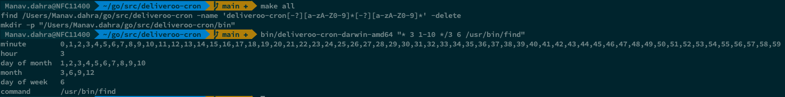

Cron Expression parser
==

This utility enables a user to pass in arguments as a combination of `cron expression + command` in standard format
`(Example: */15 0 1,15 * 1-5 /usr/bin/find)`
and spits out the output in exploded format as follows:

```text
minute        0,15,30,45
hour          0
day of month  1,15
month         1,2,3,4,5,6,7,8,9,10,11,12
day of week   1,2,3,4,5
command       /usr/bin/find
```

Setup:
==
Prerequisites: Git, GoLang

### Installing Golang:

1. For Debian:

```text
cd $HOME
mkdir -p go
apt-get update && apt-get install wget git
wget https://golang.org/dl/go1.14.6.linux-amd64.tar.gz
tar -C /usr/local -xzf go1.14.6.linux-amd64.tar.gz
export PATH=$PATH:/usr/local/go/bin
export GOPATH=$HOME/go
mkdir -p ${GOPATH}/src ${GOPATH}/bin
```

2. For Alpine:

```text
cd $HOME
mkdir -p go
apk update && apk add --no-cache musl-dev go git
export GOPATH=$HOME/go
mkdir -p ${GOPATH}/src ${GOPATH}/bin
```

3. For RPM:

```text
cd $HOME
mkdir -p go
yum update && yum install wget which git
wget https://raw.githubusercontent.com/canha/golang-tools-install-script/master/goinstall.sh
chmod +x goinstall.sh
./goinstall.sh
source /home/builder/.bashrc
mkdir -p ${GOPATH}/src ${GOPATH}/bin
```

4. For Mac OSX:

```text
cd $HOME
mkdir -p go
brew install go@1.14
export GOPATH=$HOME/go
mkdir -p ${GOPATH}/src ${GOPATH}/bin
brew install git
```

Clone repo:
==

```text
cd $GOPATH/src
# you might have to setup your git credentials before
git clone https://github.com/manavdahra/deliveroo-cron.git 
cd $GOPATH/src/deliveroo-cron
```

Run using prebuilt binaries:
==
Depending upon your platform type and architecture. Choose the relevant binary to run.

Example:
For linux x86-64

```text
bin/share/deliveroo-cron-linux-amd64  "*/15 0 1,15 * 1-5 /usr/bin/find"
```

For linux i386

```text
bin/share/deliveroo-cron-linux-386  "*/15 0 1,15 * 1-5 /usr/bin/find"
```

Similarly, for Mac OSX, following distributions are available:
`bin/share/deliveroo-cron-darwin-amd64, bin/share/deliveroo-cron-darwin-386`



Build & Run:
==
Prerequisite: Make

### Installing Make:

1. For Debian

```text
apt-get update && apt-get install build-essential
```

2. For Alpine

```text
apk update && apk add --no-cache make
```

3. For RPM

```text
yum install make
```

3. For Mac OSX

```text
brew install make
```

To build the utility follow the steps mentioned below:

```text
cd $GOPATH/src/deliveroo-cron
make all
bin/deliveroo-cron  "*/15 0 1,15 * 1-5 /usr/bin/find"
```

Unhandled fields/expressions
==

For the sake of simplicity, only standard CRON expression format is supported for now

List of **not** supported fields:

```text
@yearly
@annually
@monthly
@weekly
@daily
@hourly
@reboot
L 
W
#
?
H
```